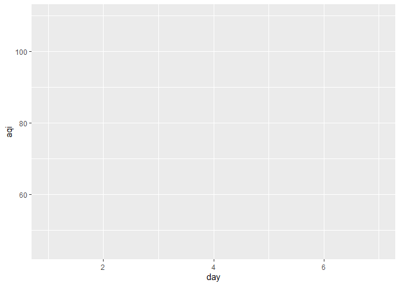
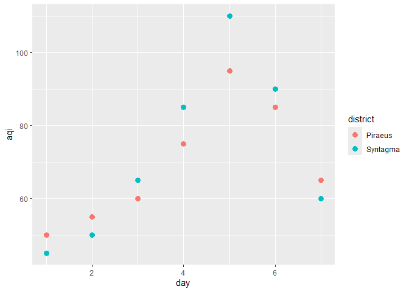
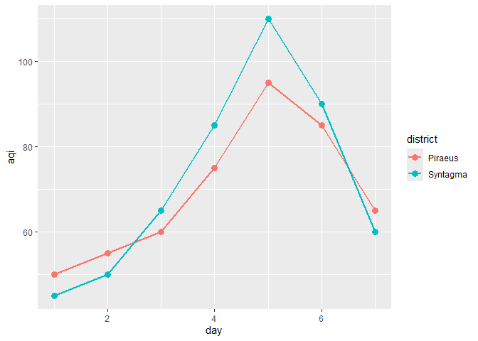
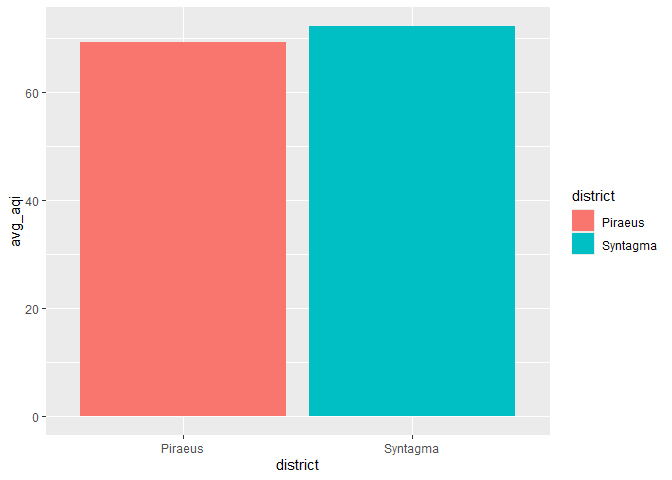
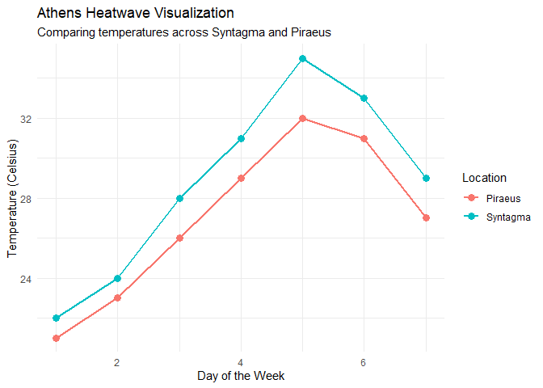
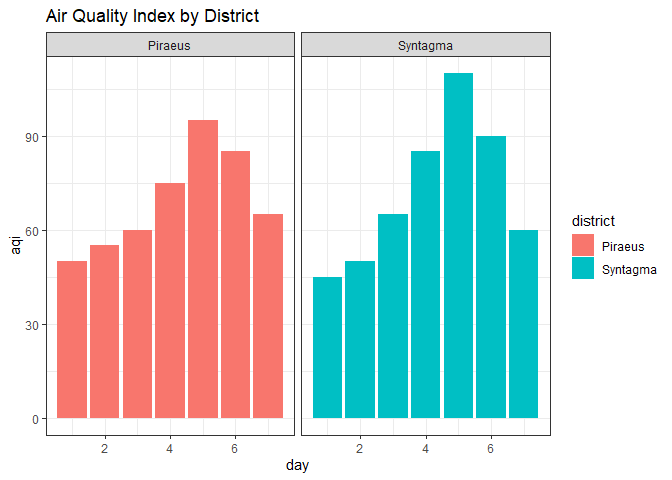

Day 16 of R Programming
================
2026-05-16

Today, I start with the Phase-3 of Data Visualization using ggplot2
package.

ggplot defines that a plot should have three layers:

- data
- aesthetics (x-axis, y-axis or color)
- geometrics (shape, bar, chart, etc)

``` r
library(tidyverse)
```

## 1. Creating our Dataset

Temperature and Air Quality over Athens and Piraeus in a week time.

``` r
athens <- tibble(
  day = 1:7,
  temp_c = c(22, 24, 28, 31, 35, 33, 29),
  aqi = c(45, 50, 65, 85, 110, 90, 60),
  district = rep("Syntagma", 7)
)

piraeus <- tibble(
  day = 1:7,
  temp_c = c(21, 23, 26, 29, 32, 31, 27),
  aqi = c(50, 55, 60, 75, 95, 85, 65),
  district = rep("Piraeus", 7)
)

df <- bind_rows(athens, piraeus)
df
```

    ## # A tibble: 14 × 4
    ##      day temp_c   aqi district
    ##    <int>  <dbl> <dbl> <chr>   
    ##  1     1     22    45 Syntagma
    ##  2     2     24    50 Syntagma
    ##  3     3     28    65 Syntagma
    ##  4     4     31    85 Syntagma
    ##  5     5     35   110 Syntagma
    ##  6     6     33    90 Syntagma
    ##  7     7     29    60 Syntagma
    ##  8     1     21    50 Piraeus 
    ##  9     2     23    55 Piraeus 
    ## 10     3     26    60 Piraeus 
    ## 11     4     29    75 Piraeus 
    ## 12     5     32    95 Piraeus 
    ## 13     6     31    85 Piraeus 
    ## 14     7     27    65 Piraeus

## 2. Base Canvas

The Blank basic chart which we will use for all the plots later.

``` r
ggplot(data = df, mapping = aes(x = day, y = aqi))
```

<!-- -->

## 3. Add Geometrics (data points)

``` r
ggplot(data = df, mapping = aes(x = day, y = aqi)) + 
  geom_point()
```

<!-- -->

## 4. Add Aesthetics (Color and Size)

``` r
ggplot(data = df, mapping = aes(x = day, y = aqi, color = district)) +
  geom_point(size = 3)
```

<!-- -->

## 5. More layers

``` r
ggplot(data = df, mapping = aes(x = day, y = aqi, color = district)) + 
  geom_point(size = 3) + 
  geom_line(linewidth = 1)
```

<!-- -->

## 6. Combining dplyr and ggplot

``` r
df %>% 
  group_by(district) %>% 
  summarize(avg_aqi = mean(aqi)) %>% 
  ggplot(mapping = aes(x = district, y = avg_aqi, fill = district)) + 
  geom_col()
```

<!-- -->

## 7. Labels and Theme

``` r
ggplot(data = df, mapping = aes(x = day, y = temp_c, color = district)) +
  geom_point(size = 3) +
  geom_line(linewidth = 1) +
  labs(
    title = "Athens Heatwave Visualization",
    subtitle = "Comparing temperatures across Syntagma and Piraeus",
    x = "Day of the Week",
    y = "Temperature (Celsius)",
    color = "Location" 
  ) +
  theme_minimal()
```

<!-- -->

## 8. facet_wrap() for separate plots

``` r
ggplot(data = df, mapping = aes(x = day, y = aqi, fill = district)) +
  geom_col() +
  labs(title = "Air Quality Index by District") +
  theme_bw() +
  facet_wrap(~ district)
```

<!-- -->
