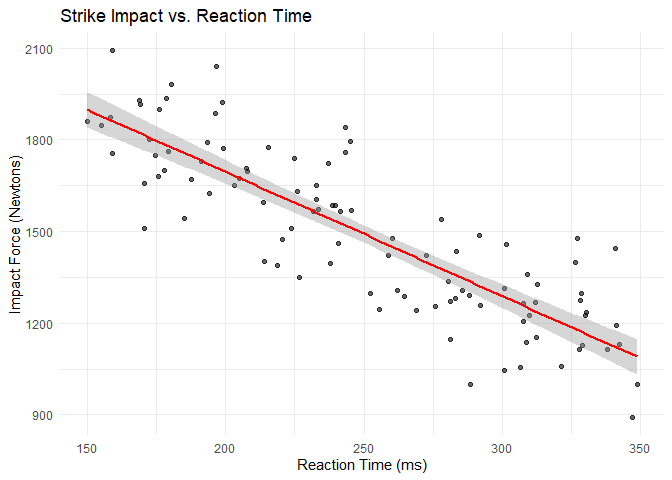
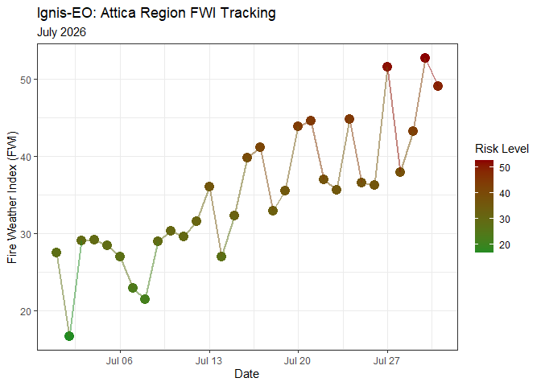
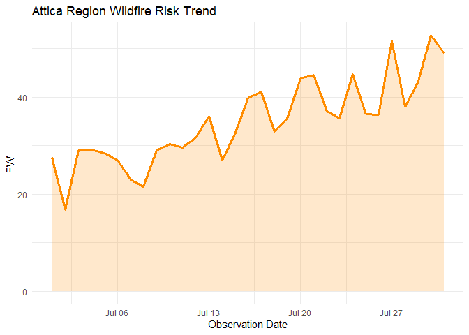

Day 18 of R Programming
================
2026-05-18

Today I learn how to map relationships, customize colors manually, and
handle dates on the X-axis for time series data.

``` r
library(tidyverse)
set.seed(123)
```

## 1. Finding relationalships using geom_smooth():

``` r
karate_metrics <- tibble(
  athlete_id = 1:100,
  reaction_time_ms = runif(100, min = 150, max = 350),
  impact_force_n = 2500 - (reaction_time_ms * 4) + rnorm(100, mean = 0, sd = 150) 
)

ggplot(karate_metrics, aes(x = reaction_time_ms, y = impact_force_n)) +
  geom_point(alpha = 0.6) +
  geom_smooth(method = "lm", color = "red", se = TRUE) +
  labs(
    title = "Strike Impact vs. Reaction Time",
    x = "Reaction Time (ms)",
    y = "Impact Force (Newtons)"
  ) +
  theme_minimal()
```

    ## `geom_smooth()` using formula = 'y ~ x'

<!-- -->

## 2. Custom Color Gradients

When dealing with heatmaps or risk indexes, default colors aren’t
enough. Let’s create a dataset simulating the Fire Weather Index (FWI)
for the Attica region over the month of July.

``` r
attica_wildfire <- tibble(
  date = seq(as.Date("2026-07-01"), as.Date("2026-07-31"), by = "day"),
  fwi_index = runif(31, 15, 30) + (1:31 * 0.8) 
)

ggplot(attica_wildfire, aes(x = date, y = fwi_index, color = fwi_index)) +
  geom_point(size = 4) +
  geom_line(linewidth = 1, alpha = 0.5) +
  scale_color_gradient(low = "forestgreen", high = "darkred") +
  labs(
    title = "Ignis-EO: Attica Region FWI Tracking",
    subtitle = "July 2026",
    x = "Date",
    y = "Fire Weather Index (FWI)",
    color = "Risk Level"
  ) +
  theme_bw()
```

<!-- -->

## 3. Formatting Date Axes: `scale_x_date()`

``` r
ggplot(attica_wildfire, aes(x = date, y = fwi_index)) +
  geom_line(color = "darkorange", linewidth = 1.2) +
  geom_area(fill = "darkorange", alpha = 0.2) +
  scale_x_date(
    date_breaks = "1 week",   
    date_labels = "%b %d"
  ) +
  labs(
    title = "Attica Region Wildfire Risk Trend",
    x = "Observation Date",
    y = "FWI"
  ) +
  theme_minimal()
```

<!-- -->
