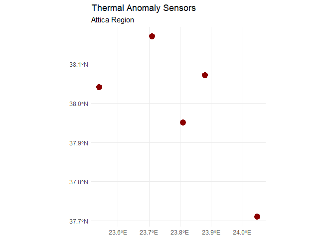
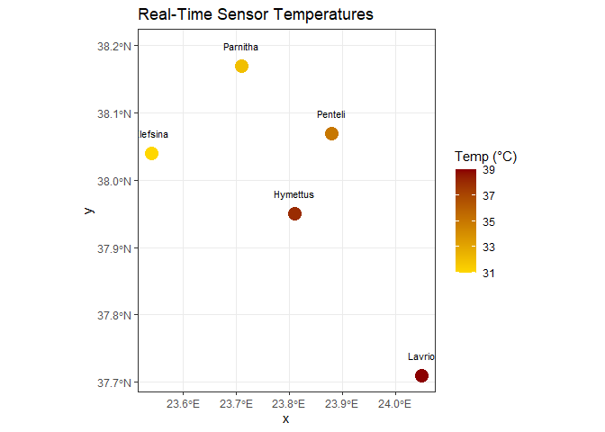

Day 19 of R Programming
================
2026-05-19

Today, I am learning how to make Geospatial Visualizations using Mapping
technique.

``` r
library(tidyverse)
library(tibble)
library(sf)
```

## 1. Creating mock dataset

``` r
attica_sensors <- tibble(
  sensor_id = c("A1", "A2", "A3", "A4", "A5"),
  location = c("Penteli", "Parnitha", "Hymettus", "Elefsina", "Lavrio"),
  lon = c(23.88, 23.71, 23.81, 23.54, 24.05),
  lat = c(38.07, 38.17, 37.95, 38.04, 37.71),
  current_temp_c = c(35, 32, 38, 31, 39)
)

head(attica_sensors)
```

    ## # A tibble: 5 × 5
    ##   sensor_id location   lon   lat current_temp_c
    ##   <chr>     <chr>    <dbl> <dbl>          <dbl>
    ## 1 A1        Penteli   23.9  38.1             35
    ## 2 A2        Parnitha  23.7  38.2             32
    ## 3 A3        Hymettus  23.8  38.0             38
    ## 4 A4        Elefsina  23.5  38.0             31
    ## 5 A5        Lavrio    24.0  37.7             39

``` r
summary(attica_sensors)
```

    ##   sensor_id           location              lon             lat       
    ##  Length:5           Length:5           Min.   :23.54   Min.   :37.71  
    ##  Class :character   Class :character   1st Qu.:23.71   1st Qu.:37.95  
    ##  Mode  :character   Mode  :character   Median :23.81   Median :38.04  
    ##                                        Mean   :23.80   Mean   :37.99  
    ##                                        3rd Qu.:23.88   3rd Qu.:38.07  
    ##                                        Max.   :24.05   Max.   :38.17  
    ##  current_temp_c
    ##  Min.   :31    
    ##  1st Qu.:32    
    ##  Median :35    
    ##  Mean   :35    
    ##  3rd Qu.:38    
    ##  Max.   :39

## 2. Converting to spatial objects (st_as_sf):

``` r
sensors_sf  <- attica_sensors %>% 
  st_as_sf(
    coords = c("lon", "lat"),
    crs = 4326
  )

head(sensors_sf)
```

    ## Simple feature collection with 5 features and 3 fields
    ## Geometry type: POINT
    ## Dimension:     XY
    ## Bounding box:  xmin: 23.54 ymin: 37.71 xmax: 24.05 ymax: 38.17
    ## Geodetic CRS:  WGS 84
    ## # A tibble: 5 × 4
    ##   sensor_id location current_temp_c      geometry
    ##   <chr>     <chr>             <dbl>   <POINT [°]>
    ## 1 A1        Penteli              35 (23.88 38.07)
    ## 2 A2        Parnitha             32 (23.71 38.17)
    ## 3 A3        Hymettus             38 (23.81 37.95)
    ## 4 A4        Elefsina             31 (23.54 38.04)
    ## 5 A5        Lavrio               39 (24.05 37.71)

## 3. Plotting using ‘geom_sf()’:

``` r
ggplot(data = sensors_sf) +
  geom_sf(color = 'darkred', size = 4) +
  labs(
    title = "Thermal Anomaly Sensors",
    subtitle = "Attica Region"
  ) +
  theme_minimal()
```

<!-- -->

## 4. Creating a heat map:

``` r
ggplot(data = sensors_sf) +
  geom_sf(aes(color = current_temp_c), size = 5) + 
  scale_color_gradient(low = "gold", high = "darkred") +
  geom_sf_text(aes(label = location), nudge_y = 0.03, size = 3) + 
  labs(
    title = "Real-Time Sensor Temperatures",
    color = "Temp (°C)"
  ) +
  theme_bw()
```

    ## Warning in st_point_on_surface.sfc(sf::st_zm(x)): st_point_on_surface may not
    ## give correct results for longitude/latitude data

<!-- -->
