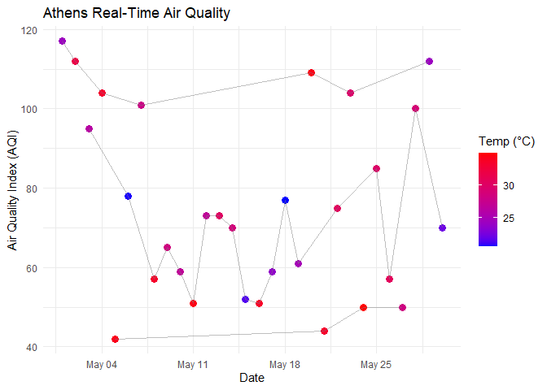
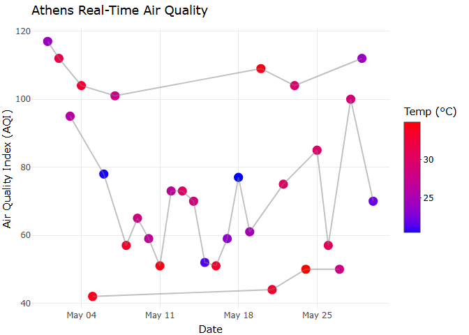

Day 20 of R programming
================
2026-05-20

# Interactive Plots using Plotly

Today, I learn about how to make my static ggplot2 into a fully
interactive web graphics using the plotly package.

``` r
library(tidyverse)
library(tibble)
library(plotly)
library(webshot2)
```

## 1. Our own dataset

``` r
set.seed(123)

athens_metrics <- tibble(
  date = seq(as.Date("2026-05-01"), as.Date("2026-05-30"), by = "day"),
  temp_c = round(runif(30, 20, 35), 1),
  aqi = round(runif(30, 40, 120), 0)
) %>% 
  mutate(
    status = case_when(
      aqi <= 50 ~ "Good",
      aqi > 50 & aqi <= 100 ~ "Moderate",
      aqi > 100 ~ "Unhealthy"
    )
  )

head(athens_metrics)
```

    ## # A tibble: 6 × 4
    ##   date       temp_c   aqi status   
    ##   <date>      <dbl> <dbl> <chr>    
    ## 1 2026-05-01   24.3   117 Unhealthy
    ## 2 2026-05-02   31.8   112 Unhealthy
    ## 3 2026-05-03   26.1    95 Moderate 
    ## 4 2026-05-04   33.2   104 Unhealthy
    ## 5 2026-05-05   34.1    42 Good     
    ## 6 2026-05-06   20.7    78 Moderate

## 2. Static Base Chart:

``` r
static_plot <- ggplot(data = athens_metrics, aes(x = date, y = aqi, color = temp_c, text = status)) +
  geom_point(size = 3) +
  geom_line(color = "grey50", alpha = 0.5) +
  scale_color_gradient(low = "blue", high = "red") +
  labs(
    title = "Athens Real-Time Air Quality",
    x = "Date",
    y = "Air Quality Index (AQI)",
    color = "Temp (°C)"
  ) +
  theme_minimal()

static_plot
```

<!-- -->

## 3. Interactive Plot:

``` r
ggplotly(static_plot)
```

    ## file:///C:/Users/Admin/AppData/Local/Temp/Rtmp8OjdAr/file507858657cf/widget507822241b04.html screenshot completed

<!-- -->
