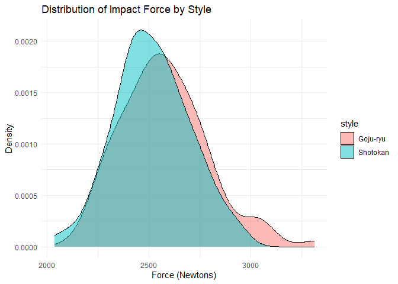

Day 26 of R Programming
================
2026-05-26

Today, I learn about the Exploratory Data analysis techniques and
Hypothesis Testing.

``` r
library(tidyverse)
```

## 1. Creating the dataset:

``` r
set.seed(123)

impact_data <- tibble(
  athlete_id = 1:200,
  style = rep(c("Shotokan", "Goju-ryu"), each = 100),
  force_n = c(rnorm(100, mean = 2500, sd = 200), rnorm(100, mean = 2600, sd = 220))
)

head(impact_data)
```

    ## # A tibble: 6 × 3
    ##   athlete_id style    force_n
    ##        <int> <chr>      <dbl>
    ## 1          1 Shotokan   2388.
    ## 2          2 Shotokan   2454.
    ## 3          3 Shotokan   2812.
    ## 4          4 Shotokan   2514.
    ## 5          5 Shotokan   2526.
    ## 6          6 Shotokan   2843.

## 2. EDA:

``` r
impact_data %>% group_by(style) %>% 
  summarize(
    mean_force = mean(force_n),
    median_force = median(force_n),
    sd_force = sd(force_n),
    min = min(force_n),
    max = max(force_n)
  )
```

    ## # A tibble: 2 × 6
    ##   style    mean_force median_force sd_force   min   max
    ##   <chr>         <dbl>        <dbl>    <dbl> <dbl> <dbl>
    ## 1 Goju-ryu      2576.        2550.     213. 2148. 3313.
    ## 2 Shotokan      2518.        2512.     183. 2038. 2937.

## 3. Probability Distribution using Density Plot:

``` r
ggplot(impact_data, aes(x = force_n, fill = style)) +
  geom_density(alpha = 0.5) +
  labs(
    title = "Distribution of Impact Force by Style", 
    x = "Force (Newtons)", 
    y = "Density"
  ) +
  theme_minimal()
```

<!-- -->

## 4. Hypothesis Testing: 2 sample t-test

- **Null Hypothesis (H0):** There is NO difference in average impact
  force between the styles.
- **Alternative Hypothesis (H1):** There IS a difference.

``` r
test_result <- t.test(force_n ~ style, data = impact_data)

test_result
```

    ## 
    ##  Welch Two Sample t-test
    ## 
    ## data:  force_n by style
    ## t = 2.0782, df = 193.54, p-value = 0.03901
    ## alternative hypothesis: true difference in means between group Goju-ryu and group Shotokan is not equal to 0
    ## 95 percent confidence interval:
    ##    2.968612 113.548434
    ## sample estimates:
    ## mean in group Goju-ryu mean in group Shotokan 
    ##               2576.340               2518.081

### From the result, we can say that p-value is below 0.05, the difference in impact force between our two simulated groups is statistically significant.

But T-test is only used for 2 samples. For 3 or more samples, we have
different test:

## 5. ANOVA Test:

``` r
set.seed(102)
impact_data_multi <- tibble(
  style = rep(c("Shotokan", "Goju-ryu", "Kyokushin"), each = 100),
  force_n = c(rnorm(100, 2500, 200), rnorm(100, 2600, 220), rnorm(100, 2800, 250))
)

anova <- aov(force_n ~ style, data = impact_data_multi)

summary(anova)
```

    ##              Df   Sum Sq Mean Sq F value   Pr(>F)    
    ## style         2  2810934 1405467   28.21 6.05e-12 ***
    ## Residuals   297 14795282   49816                     
    ## ---
    ## Signif. codes:  0 '***' 0.001 '**' 0.01 '*' 0.05 '.' 0.1 ' ' 1

## 6. The Post-Hoc Test (Tukey HSD)

ANOVA has a catch: it tells you a difference exists, but it doesn’t tell
you *which* styles are different. Is Shotokan different from Goju-ryu,
or is Kyokushin skewing the whole test?

To find out exactly where the differences lie, we pass our ANOVA result
into a **Tukey’s Honest Significant Difference (HSD)** test.

``` r
TukeyHSD(anova)
```

    ##   Tukey multiple comparisons of means
    ##     95% family-wise confidence level
    ## 
    ## Fit: aov(formula = force_n ~ style, data = impact_data_multi)
    ## 
    ## $style
    ##                          diff        lwr         upr     p adj
    ## Kyokushin-Goju-ryu  149.89174   75.54087  224.242616 0.0000095
    ## Shotokan-Goju-ryu   -84.15587 -158.50674   -9.804992 0.0219929
    ## Shotokan-Kyokushin -234.04761 -308.39848 -159.696734 0.0000000

## 7. Chi-Square Test: Categorical vs. Categorical

``` r
set.seed(123)

tournament_data <- tibble(
  stance = sample(c("Orthodox", "Southpaw"), 200, replace = TRUE),
  medal_won = sample(c("Yes", "No"), 200, replace = TRUE, prob = c(0.3, 0.7))
)

contingency_table <- table(tournament_data$stance, tournament_data$medal_won)
print(contingency_table)
```

    ##           
    ##            No Yes
    ##   Orthodox 74  29
    ##   Southpaw 66  31

``` r
chisq.test(contingency_table)
```

    ## 
    ##  Pearson's Chi-squared test with Yates' continuity correction
    ## 
    ## data:  contingency_table
    ## X-squared = 0.18683, df = 1, p-value = 0.6656

From the p-value\>0.05, we can say that the choice of stance doesn’t
affect the chances of medals won.
