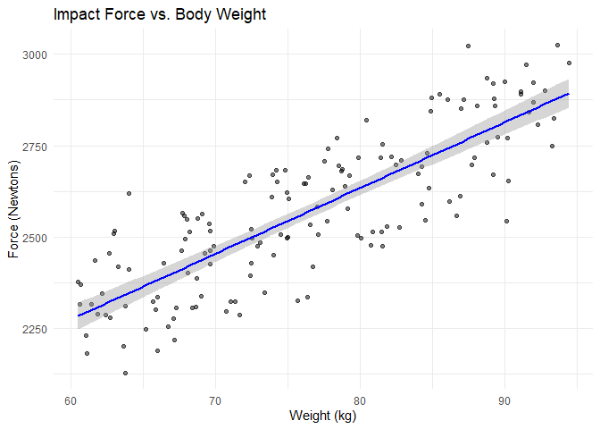
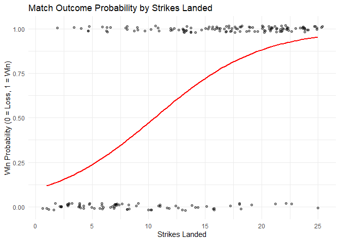

Day 27 of R Programming
================
2026-05-27

Today, I learn about Predictive Modeling using Linear and Logistic
Regression.

``` r
library(tidyverse)
library(broom)
```

## 1. Our own data

``` r
set.seed(10)
training_data <- tibble(
  weight_kg = runif(150, 60, 95),
  force_n = 1200 + (weight_kg * 18) + rnorm(150, mean = 0, sd = 120)
)

head(training_data)
```

    ## # A tibble: 6 × 2
    ##   weight_kg force_n
    ##       <dbl>   <dbl>
    ## 1      77.8   2740.
    ## 2      70.7   2296.
    ## 3      74.9   2497.
    ## 4      84.3   2590.
    ## 5      63.0   2516.
    ## 6      67.9   2493.

``` r
ggplot(data = training_data, aes(x = weight_kg, y = force_n)) +
  geom_point(alpha = 0.5) +
  geom_smooth(method = "lm", color = "blue", se = TRUE) +
  labs(title = "Impact Force vs. Body Weight", x = "Weight (kg)", y = "Force (Newtons)") +
  theme_minimal()
```

    ## `geom_smooth()` using formula = 'y ~ x'

<!-- -->

## 2. Fitting the linear model

``` r
linear <- lm(force_n ~ weight_kg, data = training_data)

tidy(linear)
```

    ## # A tibble: 2 × 5
    ##   term        estimate std.error statistic  p.value
    ##   <chr>          <dbl>     <dbl>     <dbl>    <dbl>
    ## 1 (Intercept)   1196.     76.5        15.6 3.78e-33
    ## 2 weight_kg       18.0     0.993      18.1 2.21e-39

## 3. Logistic Regression (Binary Classification)

``` r
set.seed(41)
match_data <- tibble(
  strikes_landed = sample(1:25, 200, replace = TRUE),
  win_probability = 1 / (1 + exp(-(-3 + 0.25 * strikes_landed))),
  win = rbinom(200, 1, win_probability)
)

ggplot(match_data, aes(x = strikes_landed, y = win)) +
  geom_point(alpha = 0.4, position = position_jitter(height = 0.02)) +
  geom_smooth(method = "glm", method.args = list(family = "binomial"), color = "red", se = FALSE) +
  labs(title = "Match Outcome Probability by Strikes Landed", x = "Strikes Landed", y = "Win Probability (0 = Loss, 1 = Win)") +
  theme_minimal()
```

    ## `geom_smooth()` using formula = 'y ~ x'

<!-- -->

``` r
logistic <- glm(win ~ strikes_landed, data = match_data, family = "binomial")

tidy(logistic)
```

    ## # A tibble: 2 × 5
    ##   term           estimate std.error statistic  p.value
    ##   <chr>             <dbl>     <dbl>     <dbl>    <dbl>
    ## 1 (Intercept)      -2.23     0.403      -5.54 3.11e- 8
    ## 2 strikes_landed    0.212    0.0303      7.02 2.27e-12

## 4. Making Predictions and Classification Thresholds

``` r
evaluated_matches <- match_data %>% 
  mutate(
    pred_prob = predict(logistic, type = "response"),
    pred_win = ifelse(pred_prob >= 0.5, 1, 0)
  )

evaluated_matches %>% 
  count(Actual = win, Predicted = pred_win)
```

    ## # A tibble: 4 × 3
    ##   Actual Predicted     n
    ##    <int>     <dbl> <int>
    ## 1      0         0    52
    ## 2      0         1    25
    ## 3      1         0    19
    ## 4      1         1   104

We are going to Perform this Predictive Modeling using R’s inbuilt
airquality dataset which have daily air quality measurements in New
York.

## 5. R Preprocessing

``` r
data("airquality")

head(airquality)
```

    ##   Ozone Solar.R Wind Temp Month Day
    ## 1    41     190  7.4   67     5   1
    ## 2    36     118  8.0   72     5   2
    ## 3    12     149 12.6   74     5   3
    ## 4    18     313 11.5   62     5   4
    ## 5    NA      NA 14.3   56     5   5
    ## 6    28      NA 14.9   66     5   6

``` r
summary(airquality)
```

    ##      Ozone           Solar.R           Wind             Temp      
    ##  Min.   :  1.00   Min.   :  7.0   Min.   : 1.700   Min.   :56.00  
    ##  1st Qu.: 18.00   1st Qu.:115.8   1st Qu.: 7.400   1st Qu.:72.00  
    ##  Median : 31.50   Median :205.0   Median : 9.700   Median :79.00  
    ##  Mean   : 42.13   Mean   :185.9   Mean   : 9.958   Mean   :77.88  
    ##  3rd Qu.: 63.25   3rd Qu.:258.8   3rd Qu.:11.500   3rd Qu.:85.00  
    ##  Max.   :168.00   Max.   :334.0   Max.   :20.700   Max.   :97.00  
    ##  NA's   :37       NA's   :7                                       
    ##      Month            Day      
    ##  Min.   :5.000   Min.   : 1.0  
    ##  1st Qu.:6.000   1st Qu.: 8.0  
    ##  Median :7.000   Median :16.0  
    ##  Mean   :6.993   Mean   :15.8  
    ##  3rd Qu.:8.000   3rd Qu.:23.0  
    ##  Max.   :9.000   Max.   :31.0  
    ## 

``` r
df <- airquality %>% 
  rename_all(tolower) %>% 
  mutate(
    ozone = ifelse(is.na(ozone), median(ozone, na.rm = TRUE), ozone),
    solar.r = ifelse(is.na(solar.r), median(solar.r, na.rm = TRUE), solar.r)
  ) %>% 
  mutate(
    hazardous_day = ifelse(ozone > mean(ozone), 1, 0)
  )

summary(df)
```

    ##      ozone           solar.r           wind             temp      
    ##  Min.   :  1.00   Min.   :  7.0   Min.   : 1.700   Min.   :56.00  
    ##  1st Qu.: 21.00   1st Qu.:120.0   1st Qu.: 7.400   1st Qu.:72.00  
    ##  Median : 31.50   Median :205.0   Median : 9.700   Median :79.00  
    ##  Mean   : 39.56   Mean   :186.8   Mean   : 9.958   Mean   :77.88  
    ##  3rd Qu.: 46.00   3rd Qu.:256.0   3rd Qu.:11.500   3rd Qu.:85.00  
    ##  Max.   :168.00   Max.   :334.0   Max.   :20.700   Max.   :97.00  
    ##      month            day       hazardous_day   
    ##  Min.   :5.000   Min.   : 1.0   Min.   :0.0000  
    ##  1st Qu.:6.000   1st Qu.: 8.0   1st Qu.:0.0000  
    ##  Median :7.000   Median :16.0   Median :0.0000  
    ##  Mean   :6.993   Mean   :15.8   Mean   :0.3007  
    ##  3rd Qu.:8.000   3rd Qu.:23.0   3rd Qu.:1.0000  
    ##  Max.   :9.000   Max.   :31.0   Max.   :1.0000

## 5. Train-Test Split

``` r
set.seed(123)

train_indices <- sample(seq_len(nrow(df)), size = 0.8 * nrow(df))

train_data <- df[train_indices, ]
test_data <- df[-train_indices, ]

print(paste("Training Rows:", nrow(train_data), " Test Rows: ", nrow(test_data)))
```

    ## [1] "Training Rows: 122  Test Rows:  31"

## 6. Linear Regression

``` r
linear_model <- lm(ozone ~ temp + wind, data = train_data)

tidy(linear_model)
```

    ## # A tibble: 3 × 5
    ##   term        estimate std.error statistic     p.value
    ##   <chr>          <dbl>     <dbl>     <dbl>       <dbl>
    ## 1 (Intercept)   -36.0     21.8       -1.65 0.102      
    ## 2 temp            1.30     0.232      5.61 0.000000132
    ## 3 wind           -2.61     0.633     -4.13 0.0000671

## 7. Logistic Regression

``` r
logistic_model <- glm(hazardous_day ~ temp + wind, data = train_data, family = "binomial")

tidy(logistic_model)
```

    ## # A tibble: 3 × 5
    ##   term        estimate std.error statistic   p.value
    ##   <chr>          <dbl>     <dbl>     <dbl>     <dbl>
    ## 1 (Intercept)  -15.4      4.09       -3.77 0.000166 
    ## 2 temp           0.208    0.0485      4.29 0.0000177
    ## 3 wind          -0.262    0.0956     -2.74 0.00620

## 8. Model Evaluation

``` r
test_eval <- test_data %>% 
  mutate(
    pred_probability = predict(logistic_model, newdata = test_data, type = "response"),
    # Classify as 1 if probability is >= 50%
    pred_hazardous = ifelse(pred_probability >= 0.5, 1, 0)
  )

confusion_matrix <- test_eval %>% 
  count(Actual = hazardous_day, Predicted = pred_hazardous)

confusion_matrix
```

    ##   Actual Predicted  n
    ## 1      0         0 20
    ## 2      0         1  1
    ## 3      1         0  3
    ## 4      1         1  7

``` r
accuracy <- test_eval |> 
  summarize(accuracy = sum(hazardous_day == pred_hazardous) / n())

print(paste("Model Accuracy on Unseen Data:", round(accuracy$accuracy * 100, 1), "%"))
```

    ## [1] "Model Accuracy on Unseen Data: 87.1 %"
