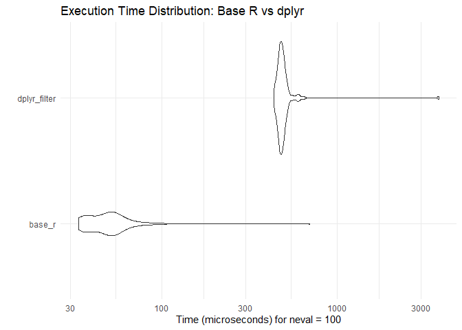

Day 28 of R Programming
================
2026-05-28

Today, I am learning about making a Shiny app with UI and Server and
doing benchmarking with that.

## Code Optimizing with ‘microbenchmark’

``` r
library(tidyverse)
library(microbenchmark)
```

## Base R vs. dplyr

``` r
test <-  microbenchmark(
  base_r = airquality[airquality$Temp > 80, ],
  
  dplyr_filter = filter(airquality, Temp > 80), 
  times = 100
)

print(test)
```

    ## Unit: microseconds
    ##          expr   min     lq    mean median     uq    max neval
    ##        base_r  33.6  37.70  55.887  49.70  55.60  694.9   100
    ##  dplyr_filter 435.3 465.75 519.616 480.65 499.55 3796.2   100

## Interpreting the results

``` r
autoplot(test) +
  theme_minimal() +
  labs(title = "Execution Time Distribution: Base R vs dplyr")
```

<!-- -->
